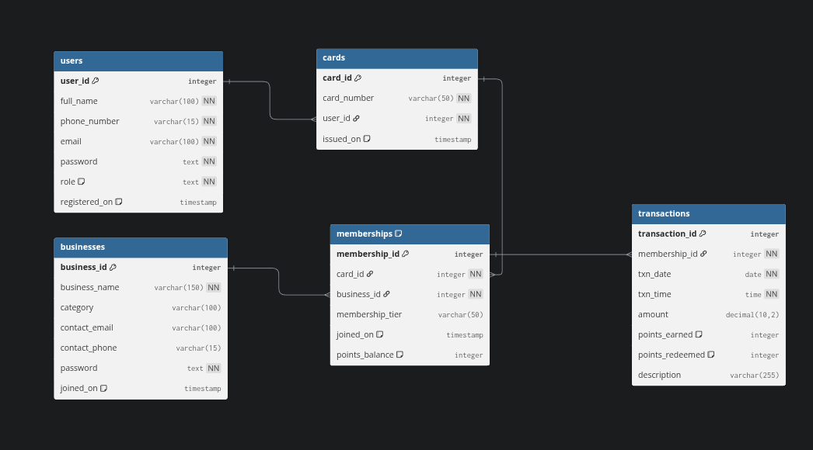

# Kardo
A unified multi-tenant membership management system where users access multiple businesses with a single physical or digital card. Supports tiered memberships, reward points, transactions, and cross-business access. Scalable design for merchants, simple unified experience for customers.


Absolutely! You can add an **image of your database schema** to the README using Markdown syntax. Here’s how I would modify your README to include an optional schema image section:

---

## Overview

This project implements a **multi-role loyalty card management system** using **Flask** and **SQLite**, providing a central platform to manage universal loyalty cards, merchants, and user transactions. The system supports **three types of logins**:

1. **Users** – Cardholders who can view their transaction history and points balances. *(Dashboard / features: To Do)*
2. **Vendors** – Businesses that can track their customers, view analytics, and manage their loyalty programs.
3. **Admin** – Superuser who can manage vendors, view system statistics, and oversee the platform.

---

## Features

* **Multi-role authentication** with hashed passwords (bcrypt) and role-based access control.
* **Custom ORM-like classes** for `Users` and `Vendors` to interact with SQLite.
* **Database Schema** includes:

  * `users` – cardholders and admins (`user_id`, `full_name`, `phone_number`, `email`, `password`, `role`, `registered_on`)
  * `businesses` – vendor information (`business_id`, `business_name`, `category`, `contact_email`, `contact_phone`, `password`, `joined_on`)
  * `cards` – universal cards linked to users
  * `memberships` – card memberships for each business
  * `transactions` – records of user purchases and points earned/redeemed
  Database is automatically initialized on first run.

### Database Schema Diagram



---

## Tech Stack

* **Backend**: Flask (Python)
* **Database**: SQLite
* **Password Security**: bcrypt
* **ORM**: Custom Python classes to interface with SQLite
* **API**: JSON-based endpoints for registration and login

---

## Getting Started

1. **Clone the repository**

```bash
git clone <repo-url>
cd <project-directory>
```

2. **Install dependencies**

```bash
pip install -r requirements.txt
```

---

## API Endpoints (examples)

* **User registration**
  `POST /register/user`
  Payload:

```json
{
  "fullname": "Alice Johnson",
  "phone": "9876543210",
  "email": "alice@example.com",
  "password": "userpassword"
}
```

* **Vendor registration**
  `POST /register/vendor`
  Payload:

```json
{
  "business_name": "BestMart",
  "category": "Retail",
  "contact_email": "vendor@bestmart.com",
  "contact_phone": "9123456780",
  "password": "vendorpassword"
}
```

* **Login**
  `POST /login` (for users or vendors)
  Payload:

```json
{
  "email": "admin@example.com",
  "password": "adminpassword"
}
```

---

## Notes

* The system currently supports **database connection and login functionality** for all roles.
* **User dashboards, admin statistics, and vendor analytics** are planned features (TODO).
* Admin user is created with `user_id = 0` during initial setup and cannot be deleted.
