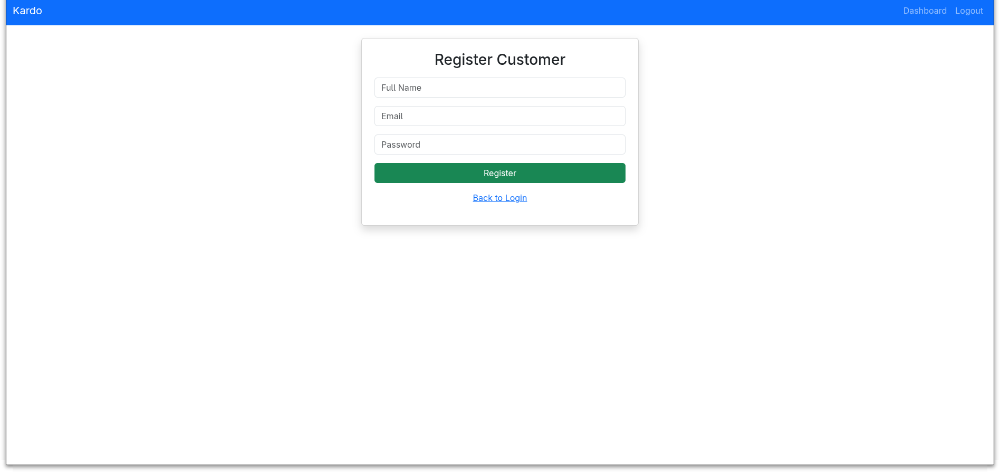

# Kardo
A unified multi-tenant membership management system where users access multiple businesses with a single physical or digital card. Supports tiered memberships, reward points, transactions, and cross-business access. Scalable design for merchants, simple unified experience for customers.

This project implements a **multi-role loyalty card management system** using **Flask** and **SQLite**, providing a central platform to manage universal loyalty cards, merchants, and user transactions. The system supports **three types of logins**:

1. **Users** – Cardholders who can view their transaction history and points balances. *(Dashboard / features: To Do)*
2. **Vendors** – Businesses that can track their customers, view analytics, and manage their loyalty programs.
3. **Admin** – Superuser who can manage vendors, view system statistics, and oversee the platform.

----------


## Table of Contents
- [Features](#features)
- [Setup Instructions](#setup-instructions)
- [Schema Diagram](#schema-diagram)
- [Screenshots](#screenshots)
- [Developer Notes](#-developer-notes)


----------

## Project Structure

```text
Kardo/
├── config.py                  # Configuration file (DB URI, secret keys, etc.)
├── Front-end/                  # Frontend app using Flask
│   ├── app.py                  # Flask app for frontend routes
│   ├── static/                 # CSS, JS, images
│   │   └── styles.css
│   └── templates/              # HTML templates
│       ├── base.html
│       ├── dashboard_admin.html
│       ├── dashboard_business.html
│       ├── dashboard_customer.html
│       ├── login.html
│       ├── register_business.html
│       └── register_customer.html
├── images/                     # Screenshots and Schema
│   ├── admin_dash.png
│   ├── customer_register.png
│   ├── customer_dash.png
│   ├── login_page.png
│   ├── Schema.jpeg
│   ├── vendor_dash.png
│   └── vendor_register.png
├── kardo.db                    # SQLite database
├── models.py                   # SQLAlchemy models for Users, Businesses, Memberships, Transactions
├── modules/                    # Utility modules
│   └── security.py             # Password hashing, authentication helpers
├── routes/                     # Backend route handlers
│   ├── admin.py
│   ├── auth.py
│   ├── business.py
│   └── customer.py
├── server.py                   # Backend Flask server
├── requirements.txt            # Python dependencies
└── README.md                   # Project documentation

```

----------

## Setup Instructions

### 1. Clone the repository

```bash
git clone <repository-url>
cd Kardo

```

### 2. Create virtual environment

```bash
python -m venv venv
source venv/bin/activate   # Linux/macOS
venv\Scripts\activate      # Windows

```

### 3. Install dependencies

```bash
pip install -r requirements.txt

```


### 4. Run Backend Server (localhost:5000)

```bash
python server.py

```


### 5. Run Frontend Server (localhost:5001)

```bash
cd Front-end
python app.py

```

----------

## Backend

The backend handles:

-   User authentication and authorization
    
-   Admin, Business, and Customer CRUD operations
    
-   Membership management and point adjustments
    
-   Transaction logging
    

Backend files:

-   `server.py` – main backend Flask app
    
-   `routes/` – separate modules for `admin`, `business`, `customer`, `auth`
    
-   `models.py` – database models
    
-   `modules/security.py` – hashing and password utilities
    

----------

## Frontend

The frontend is a Flask app serving HTML templates using Bootstrap:

-   `Front-end/app.py` – main frontend Flask app
    
-   `templates/` – HTML pages for login, registration, dashboards
    
-   `static/styles.css` – custom CSS
    

----------

## Database

-   SQLite database (`kardo.db`)
    
-   Models include Users, Businesses, Memberships, and Transactions
    
-   SQLAlchemy used for ORM
    

----------

## Features

-   Admin Dashboard: Add/Delete Users & Businesses, adjust points
    
-   Business Dashboard: Manage memberships, adjust points
    
-   Customer Dashboard: View points and membership info
    
-   Login/Register pages for all roles
    

----------

## Schema Diagram


----------

## Screenshots of Demo

### Login Page


### Admin Dashboard


### Business Dashboard


### Customer Dashboard


### Customer Registration



### Business Registration


----------
Perfect — let’s document the **API JSON request/response examples** for each role (Admin, Business, Customer).  
This will give you a clear **frontend contract** to work against.

----------

# **Authentication**

### Login

**POST** `/auth/login`  
Request:

```json
{
  "username": "admin",
  "password": "admin123"
}

```

Response (success):

```json
{
  "access_token": "eyJhbGciOiJIUzI1NiIsInR5...",
  "role": "admin",
  "username": "admin"
}

```

Response (failure):

```json
{
  "msg": "Invalid credentials"
}

```

----------

# **Admin APIs**

### View All Users

**GET** `/admin/users`  
Response:

```json
[
  {
    "id": 2,
    "username": "john",
    "role": "customer"
  },
  {
    "id": 3,
    "username": "acme_inc",
    "role": "business"
  }
]

```

### Add New User

**POST** `/admin/add_user`  
Request:

```json
{
  "username": "jane",
  "password": "securepass",
  "role": "customer"
}

```

Response:

```json
{ "msg": "User added successfully" }

```

### Add Business

**POST** `/admin/add_business`  
Request:

```json
{
  "name": "Acme Inc",
  "email": "support@acme.com"
}

```

Response:

```json
{ "msg": "Business created successfully" }

```

### Adjust Membership Points

**POST** `/admin/adjust_points`  
Request:

```json
{
  "membership_id": 5,
  "points": 100
}

```

Response:

```json
{ "msg": "Points updated successfully" }

```

### View Transactions

**GET** `/admin/transactions`  
Response:

```json
[
  {
    "id": 1,
    "membership_id": 5,
    "change": +100,
    "reason": "Admin adjustment",
    "timestamp": "2025-10-01T12:34:56"
  }
]

```

----------

#  **Business APIs**

### View Dashboard

**GET** `/business/dashboard`  
Response:

```json
{
  "business_id": 3,
  "business_name": "Acme Inc",
  "total_memberships": 20,
  "total_points": 14500
}

```

### View Memberships

**GET** `/business/memberships`  
Response:

```json
[
  {
    "membership_id": 5,
    "customer": "john",
    "tier": "Gold",
    "points": 450
  },
  {
    "membership_id": 6,
    "customer": "jane",
    "tier": "Silver",
    "points": 150
  }
]

```

### Add Membership

**POST** `/business/add_membership`  
Request:

```json
{
  "customer_id": 2,
  "tier": "Silver"
}

```

Response:

```json
{ "msg": "Membership created successfully" }

```

### Adjust Points

**POST** `/business/adjust_points`  
Request:

```json
{
  "membership_id": 5,
  "points": -50
}

```

Response:

```json
{ "msg": "Points updated successfully" }

```

### View Transactions

**GET** `/business/transactions`  
Response:

```json
[
  {
    "id": 10,
    "membership_id": 5,
    "change": -50,
    "reason": "Purchase",
    "timestamp": "2025-10-01T13:00:00"
  }
]

```

----------

# **Customer APIs**

### View Dashboard

**GET** `/customer/dashboard`  
Response:

```json
{
  "customer_id": 2,
  "username": "john",
  "total_points": 600,
  "active_memberships": 2
}

```

### View Memberships

**GET** `/customer/memberships`  
Response:

```json
[
  {
    "membership_id": 5,
    "business": "Acme Inc",
    "tier": "Gold",
    "points": 450
  },
  {
    "membership_id": 7,
    "business": "CoffeeCo",
    "tier": "Silver",
    "points": 150
  }
]

```

### View Transactions

**GET** `/customer/transactions`  
Response:

```json
[
  {
    "id": 12,
    "membership_id": 7,
    "change": +150,
    "reason": "Points earned",
    "timestamp": "2025-10-01T10:30:00"
  }
]

```

----------

## Dependencies

See `requirements.txt` for full list of Python packages.

-   Flask
    
-   SQLAlchemy
    
-   Flask-JWT-Extended
    
-   Werkzeug (for password hashing)
    
-   Bootstrap (via CDN)
    


## 👨‍💻 Developer Notes

Kardo currently has seamless login and registration with role-based dashboards. Backend routes for user, business, and points management exist, but the frontend only supports authentication flows. Admin and Vendor tasks are not yet wired into the UI. Next steps: connect frontend to backend CRUD and add profile editing.
